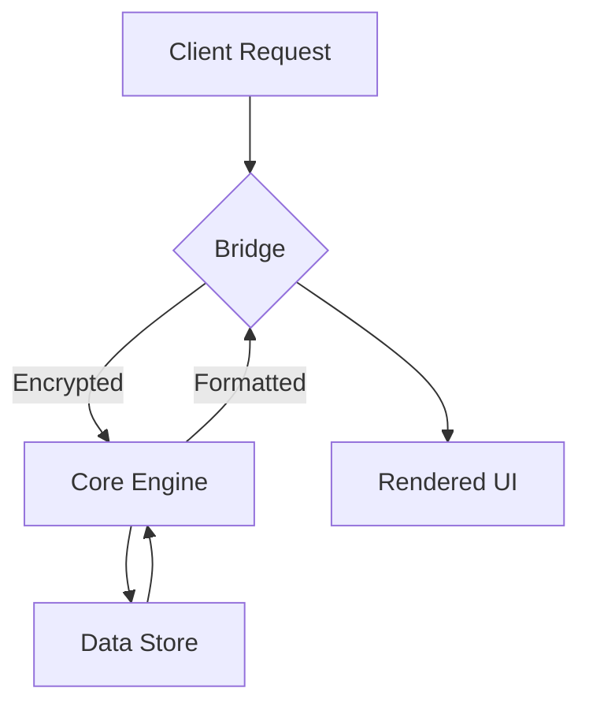

# Architecture Overview

Deep dive into the internal structure of the NLFTs Protocol.

## The Core Engine

The engine is built on top of a passive API layer that handles data manipulation without active polling.

### Key Components

1.  **Hydration Engine**: Ensures fast transitions between server and client states.
2.  **Pixel Ecosystem**: Responsive UI components optimized for high performance.
3.  **Encrypted Bridge**: Secure data transfer between protocol modules.

## Data Flow Diagram

The following diagram illustrates how data travels through the system:

## Next Steps

Learn more about the [Data Flow](/docs/concepts/data-flow) in detail.
